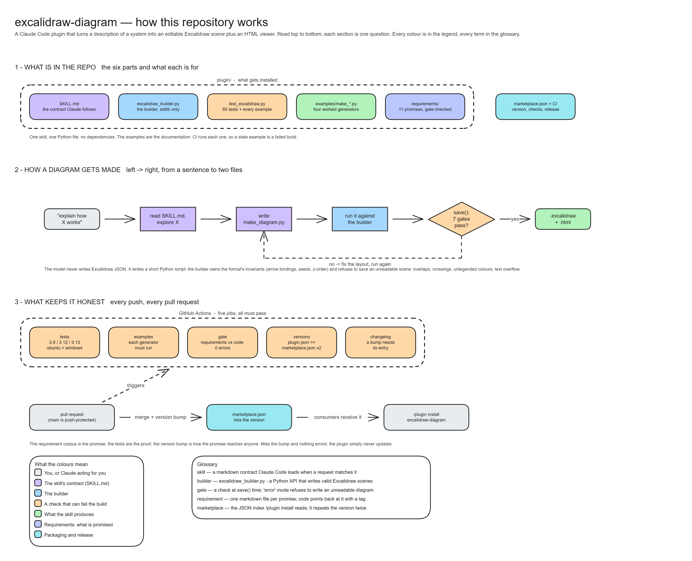
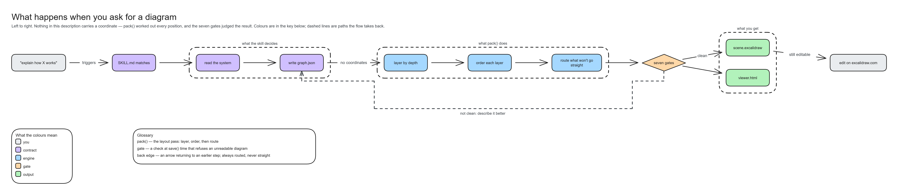
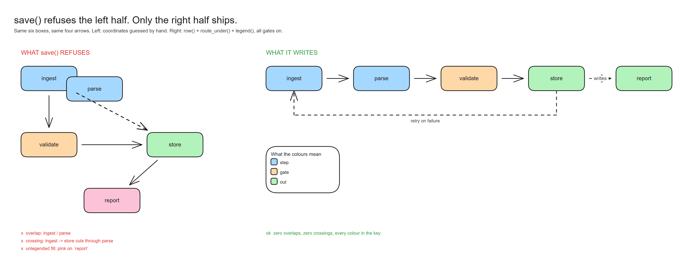
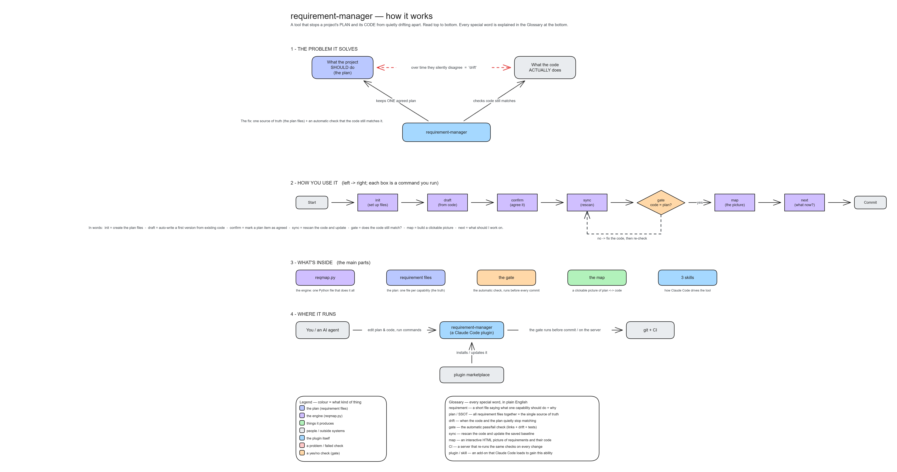
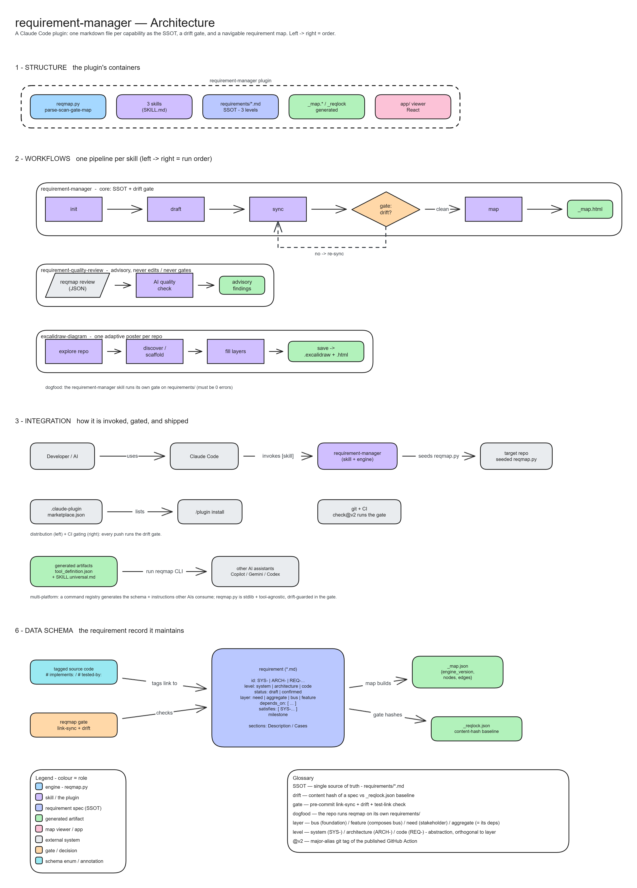
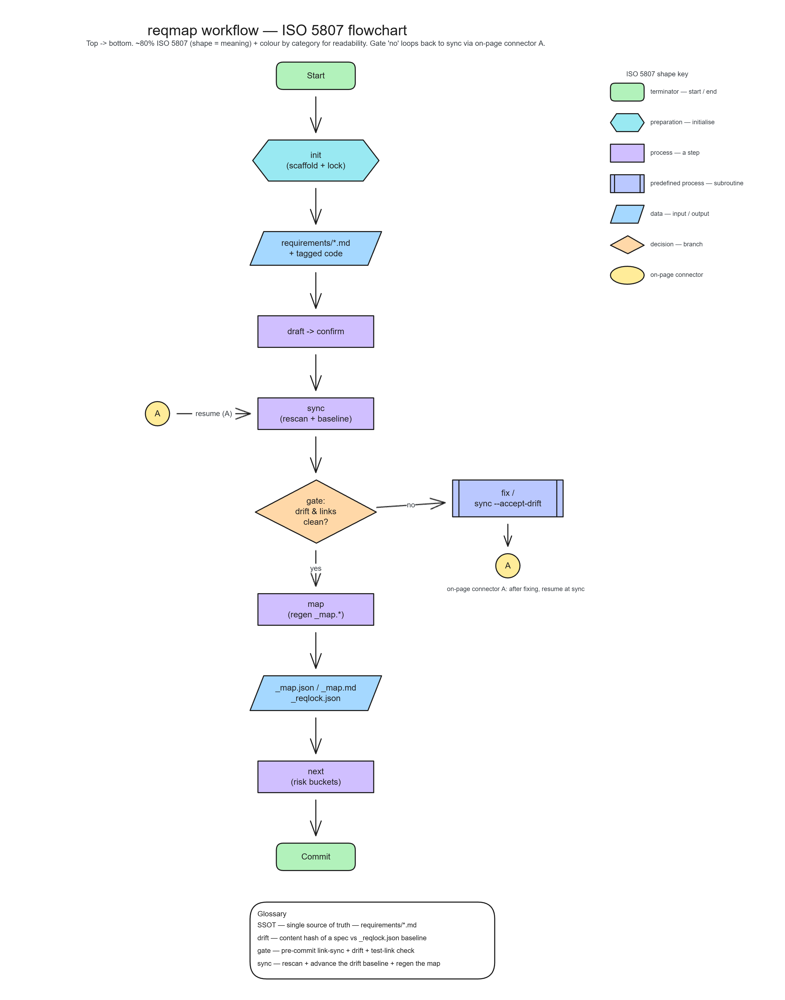
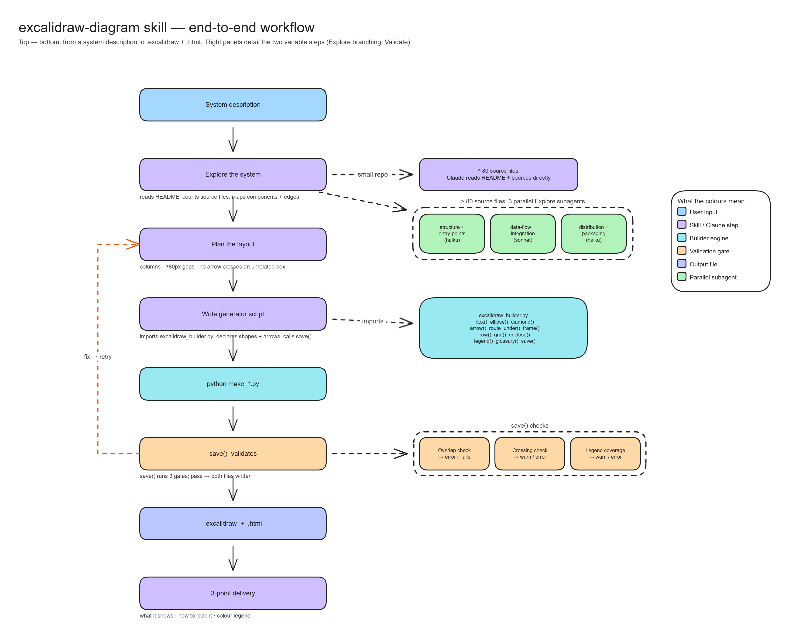

# excalidraw-diagram

A Claude Code plugin that turns a description of a system, flow or architecture into an
**editable Excalidraw scene** plus a **self-contained HTML viewer**. No npm, no service,
no API key: the builder is one stdlib-only Python file.

You describe the thing; the skill writes `<name>.excalidraw` (imports into excalidraw.com,
every element still hand-editable) and `<name>.html` (opens by double-click).



*Made with the skill, from `docs/make_repo_map.py`. Every picture below is a committed
PNG of a generator that CI runs on every push.*

## Install

```
/plugin marketplace add alxmax/excalidraw-diagram
/plugin install excalidraw-diagram
```

Then just ask. The skill triggers on its own for things like:

- "draw the architecture of this repo", "make a flowchart of this pipeline"
- "schemă excalidraw pentru …", "put the diagram in an HTML I can share"
- **"explain how X works", "I don't understand X"** — the most common case. The
  output is a teaching diagram: everyday words in the boxes, a stated reading
  direction, a legend for every colour and a glossary for every term, so someone
  who has never seen the system can read it.

## Two ways to a diagram

Describe the graph and let the builder place it:

```
cd plugin/skills/excalidraw-diagram/scripts
python excalidraw_builder.py scene --from-json graph.json -o out/
```

`graph.json` names nodes, edges, groups and a direction — **no coordinates**.
`pack()` layers the graph by depth, orders each layer to keep connected nodes
together, and routes any edge whose straight line would cut through a box.
Feedback edges are always routed, so a cycle never cuts back across the flow.



*The description that produced it is [`docs/repo_graph.json`](docs/repo_graph.json),
51 lines with no x or y in them. CI builds it on every push.*

Or write a short Python generator against the `Scene` API, for a diagram whose
layout itself carries meaning — stacked layers, a lane per tool, a poster. Both
paths end at the same seven gates.

## Why a builder rather than an LLM writing JSON

Excalidraw's format is picky in ways that are easy to get wrong and hard to see: bound
arrows need reciprocal ids on both shapes, `seed` and `versionNonce` drive the hand-drawn
look, and a scene with overlapping boxes renders as a mess rather than an error.

So the model does not author JSON. It writes a short Python script against a small
`Scene` API, and the builder owns the invariants and **checks its own output**:

```
$ python plugin/skills/excalidraw-diagram/scripts/excalidraw_builder.py
wrote /tmp/excd/smoke.excalidraw /tmp/excd/smoke.html
overlaps: [] crossings: []
OK smoke test (legend/role/align/distribute/path-bg/crossing-gate)
```

That smoke run renders every shape, runs the auto-layout and asserts nothing overlaps and
no connector crosses another. It exits non-zero on a layout regression, which is the
failure a unit test does not catch: the JSON is still perfectly valid when the diagram is
unreadable.

At `save()` time the builder runs seven gates: overlapping shapes, arrows crossing an
unrelated box, a fill colour missing from the legend, text spilling out of its box, captions
overlapping, arrows too short to draw, and arrow labels wider than their connector. Two of
them always raise; the other five can be turned from warnings into hard failures.



The left half only exists because `docs/make_gate_demo.py` opts out of the gates. Without
the opt-out, this is what the run prints instead of writing a file:

```
WARNING: arrow(s) may run through an unrelated box — reroute or move the box: ingest->store crosses 'parse'
WARNING: fill colour(s) used but not in the legend — a reader decoding by the key gets no meaning for: #fcc2d7
ValueError: 1 overlapping shape(s): 'ingest' overlaps 'parse'. Move the coordinates apart, wrap a grouping shape with container=True, or pass allow_overlap=True if intentional.
```

## What is in here

```
plugin/skills/excalidraw-diagram/
  SKILL.md                  the authoritative contract (Claude Code), 196 lines
  SKILL.universal.md        the same, for any assistant
  scripts/excalidraw_builder.py   the builder — stdlib only, no dependencies
  scripts/test_excalidraw.py      80 unit tests
  references/builder_api.md       every call, the graph.json schema
  references/worked_examples.md   the repo-poster recipe and ❌ → ✅ variants
  references/excalidraw_format.md the file-format notes the builder encodes
  examples/make_*.py        four worked generators, each runnable on its own
requirements/               the skill's requirement corpus, checked in CI
docs/make_*.py + *.png      the generators behind the pictures in this README
scripts/check_versions.py   plugin.json and marketplace.json must agree
```

## The examples are the documentation

Each generator under `examples/` runs standalone and writes into a directory you name:

```
python plugin/skills/excalidraw-diagram/examples/make_iso5807_flowchart.py out/
```

They are exercised in CI, so a generator that stops working is a build failure rather than
a stale snippet. Read one before writing your own; they are shorter than the format notes.
Every CI run also uploads a **gallery** artifact with each example's `.excalidraw` and
`.html`, built from that commit.

### `make_explainer.py` — a teaching diagram for a reader with no context

The shape the skill reaches for when someone says "explain how X works" — here turned on
the skill itself: read top to bottom, everyday words, a legend and a glossary that decode
everything on the canvas.



### `make_full_architecture.py` — a layered repo poster

This repo, drawn by the builder it documents. Structure, workflows, integration, data
schema: one stacked section per layer, a lane per authoring path, one legend for the
whole poster.



### `make_iso5807_flowchart.py` — an ISO 5807 flowchart

How the builder turns a description into two files, in standard flowchart symbols:
terminator, preparation, data, process, predefined process, decision and the on-page
connector.



### `make_excalidraw_skill_flow.py` — how the skill itself runs



## Requirements

Python **3.9+**, standard library only. That floor is the oldest version CI runs, not the
oldest the code happens to work on: a floor nothing tests is a claim, not a guarantee.

## Licence

MIT — see [LICENSE](LICENSE). Use it, change it, ship it.
