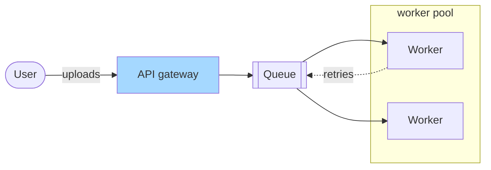

# Mermaid → `graph.json`

Someone hands you a Mermaid flowchart and wants an editable whiteboard version of it.
Read the Mermaid, write the `graph.json` it means, run `scene --from-json`. There is no
parser and none is planned: a Mermaid diagram is already a graph, `graph.json` is the
graph this builder takes, and you are the translator. The result is a real Excalidraw
scene with every element selectable — not an image pasted onto a canvas, which is what
the official JS bridge falls back to for everything except flowcharts.

**Translate only what you can read.** If a line uses syntax that is not in the table
below, say so and ask, rather than guessing. A diagram that silently drops an edge is
worse than one that was never drawn: it passes every gate and it is wrong.

## What maps onto what

| Mermaid | `graph.json` | Note |
|---|---|---|
| `flowchart TD` / `graph TD` / `TB` | `"direction": "TB"` | layers become rows |
| `flowchart LR` / `RL` | `"direction": "LR"` | layers become columns; `RL` also swaps every edge's ends |
| `A[Label]` | `{"id": "A", "label": "Label", "kind": "process"}` | the default shape |
| `A(Label)` / `A([Label])` | `"kind": "terminator"` | stadium |
| `A{Label}` | `"kind": "decision"` | diamond |
| `A[/Label/]` / `A[\Label\]` | `"kind": "data"` | parallelogram |
| `A[[Label]]` | `"kind": "predefined_process"` | framed box |
| `A{{Label}}` | `"kind": "preparation"` | hexagon |
| `A((Label))` | `"kind": "connector"` | small circle |
| `A --> B` | `{"src": "A", "dst": "B"}` | |
| `A -- text --> B` / `A -->\|text\| B` | `{"src": "A", "dst": "B", "label": "text"}` | |
| `A -.-> B` / `A -.text.-> B` | `… "dashed": true` | |
| `A === B`, `A --- B` | an edge; thickness and headless links are not modelled | say so if it mattered |
| `subgraph S [Title] … end` | `{"groups": [{"label": "Title", "members": ["A", "B"]}]}` | |
| `classDef role fill:#…` + `class A role` | `{"roles": {"role": "blue"}}` and `"fill": "role"` on the node | name the *meaning*, not the colour |
| `%% comment` | dropped | |

**What has no equivalent, and what to do about it.** `click` handlers, `style` on a
single node, edge thickness, `linkStyle`, icons and images, and every non-flowchart
diagram type (sequence, class, state, gantt, ER, journey, mindmap, pie). A state diagram
is a graph and translates like a flowchart. Sequence and ER diagrams have their own
recipes in worked example 8 of [`worked_examples.md`](worked_examples.md): write a
generator, not a `graph.json`. For the rest, name what you dropped in your reply —
never in silence.

## A worked line-by-line



```jsonc
{
  "name": "upload_flow",
  "title": "Upload flow",
  "subtitle": "Left to right: a user's upload reaches a worker through the queue.",
  "direction": "LR",
  "seed": 7,
  "roles": {"entrypoint": "blue"},          // `edge` named a colour; this names a role
  "nodes": [
    {"id": "U",   "label": "User",        "kind": "terminator"},
    {"id": "API", "label": "API gateway", "kind": "process", "fill": "entrypoint"},
    {"id": "Q",   "label": "Queue",       "kind": "predefined_process"},
    {"id": "W1",  "label": "Worker",      "kind": "process"},
    {"id": "W2",  "label": "Worker",      "kind": "process"}
  ],
  "edges": [
    {"src": "U",  "dst": "API", "label": "uploads"},
    {"src": "API", "dst": "Q"},
    {"src": "Q",  "dst": "W1"},
    {"src": "Q",  "dst": "W2"},
    {"src": "W1", "dst": "Q", "label": "retries", "dashed": true}
  ],
  "groups": [{"label": "worker pool", "members": ["W1", "W2"]}],
  "legend": true
}
```

Four things the translation added, because Mermaid has nowhere to put them and the
contract requires them: a `title`, a `subtitle` that states the reading direction, a
`seed` so a committed diagram is byte-stable, and a role name that says what the colour
*means* instead of repeating the hex. `W1 -.retries.-> Q` is a back edge; `pack()`
routes it under the row on its own, so nothing else is needed.

## After the translation

Two ids with the same label (`W1`, `W2` above) stay two nodes — Mermaid's ids are the
identity, the label is only text. Run the result, read the gate output, and check the
picture against the source: same node count, same edge count, same labels. The graph
schema itself is in [`builder_api.md`](builder_api.md).
